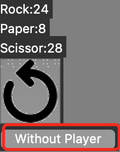

# Rock vs Paper vs Scissor


## Introduction
This is a game which simulates the Rock vs Paper vs Scissor. But we don't really play it(We don't randomly choose). Instead, we put rocks, papers, scissors on the canvas and let them fight with each other.

Unfortunately, I am not good at AI technology so actually they just randomly move in straight line, and bounce if they hit the wall. When they "fight"(it means one touches another), for example, if a rock meets a paper, the rock dies, but paper are still alive, and a new paper will be born. Very simple, right?  

This game is written by **Python** using tkinter, matplotlib modules. Notice that the following tutorial is for _BETA3.3_! And this game is written by a 13-year-old Chinese schoolboy, the game is only for practising my Python programing skill and just for fun. So many bugs may exist in it.

## Features
1. Simulate the Rock vs Paper vs Scissor game on the battlefield. Three teams are generated and spawned to fight.
2. Player can join one of the team and fight.
3. Users can replace default rock,paper,scissor images with your ones saved on the computer.

## Requirements
Before you start the game, check if you have already installed these python libraries:
```
    matplotlib==3.5.2
    Pillow
```

>(Note: I don't know why I can't use `matplotlib>=3.6`, or maybe there is a bug in matplotlib(on MacOs). If I close matplotlib window, tkinter window will also close. The only way to solve it is to add `matplotlib.use('TkAgg')`. But it seems that this line will reduce resolution of matplotlib window. So I recommend using `matplotlib==3.5.2` instead of the lastest version.)

If not, use the following commands in terminal to install them:
```
    pip install matplotlib==3.5.2
    pip install Pillow
```

Since _BETA3.3_, we use fonts to make the game look more beautiful. So maybe you need to install the following font if you don't have them:
```
    Courier
    Chalkboard
```

## Tutorial
### Basic
When you run the .py file, a tkinter window should be shown on your screen. If not or error happens, please check if you have correctly installed matplotlib & Pillow. There should be many objects running on the canvas, a few buttons and 3 scoreboards(See picture below). If these run properly, congratulations, you succeed!  


When a team is extinct, they "game over". If two teams "game over", the third will win the game. Only one team is the winner. Now you can press "Restart" button to start another new game.(See ending view below)


### Statistics
When a game ends, you will notice that there are another button to choose: "Statistic" button. If you press it, a new matplotlib window will be created. You can see the comparison of the numbers of the 3 teams in different time of the whole game. Red represents rock, green represents paper, and blue represents scissor. Very intuitive and useful, right? (See example picture below)


 
Sometimes you may see this strange situation: Scissors are going extinct, but papers eat all the rocks, finally scissors eat all the papers and win. What an interesting game!  

### Gaming History(_Advanced_)
At the bottom-left corner, there are two 'advanced' buttons: "Gaming History"(a clock⏰) and "Settings"(a gear⚙️). We first introduce "Gaming History" one.

If you press it, a new window will appear. It shows your gaming History, including 'games played','Times of rock wins'...... You can also delete your gaming history. Please think carefully before you do this, because the data will be deleted forever, you will never find it back. (See example picture below)


### Settings(_Advanced_)
This is interesting especially for people who are bored with the default rock,paper,scissor images: set customized image.

If you press the "Setting" button, a (again) new window with buttons will appear. Next press 'Rock image file' button, choose your costom rock image(support most picture extension such as .png .jpg .jpeg .webp ...). Then set the other two in the same way. Finally press 'Use costomized images', start a new game. Well done! Now your favourite animated characters are fighting!!(See example image below)


It is better to upload square images, because your images will be resized to 55px*55px by the program. You don't want to your favourite character become very fat or very thin, right?

You can also set average speed in the settings. Because we use different computers with different screens and CPUs, their processing speed are different as well. If you find that objects move too fast or too slow, try to adjust average speed! Some players want to experience more exciting battle, set average speed faster! (See example picture below).

Since _BETA3.3_, you can also set other things: canvas width, canvas height, team size. Please set them properly, or the game will slightly slow down 


### Game 'controlled' by you(_Advaced_)(_BETA_)
This new feature is added in version _BETA3.0_. And it is in developing stage so perhaps there are many bugs in it. (See example image below)

If you press the "Controller" button at the bottom-right corner, a new window will be created. Press "Start a new game that you control" button to start a game in this mode. In this mode, you will join one of the teams(Rock or Paper or Scissor). Use '_wasd_' to control your character. Eat your preys and run away from your natural enemy. Average speed(see _**Settings**_) affects your speed. Costomized images can also be used in this mode(Ready to become your favourite animated character?).

In version _BETA3.2_, preparation time was added in this game. If game is started in this mode, there will be a 3-second(actually 4) preparation time for you to find your character. Your character differs from the others: Yours has a red border, so you can easily recognize your character.

In version _BETA3.3_, we added a new button under the Restart button(See picture below). Before _BETA3.3_, if you want to start a game in this mode, you have to click Controller button and ...(complicated operation). Now users can set whether player participates or not easily. And don't need to set many times like before! 



I hope this tutorial will help you!

## TODO
(Sort by difficulty)
- [x] Be enable to set battlefield(canvas) size and the number of competitors. (BETA3.3)
- [ ] Convert .py to .app/.exe file. (Publish releases)
- [ ] Be enable to play LAN 2-player-game.

## Contact me
Full Name: ShiYuan Fan

Email: fanfansmilkyway@gmail.com / fanfansmilkyway@qq.com

Telephone: +086 13917672096